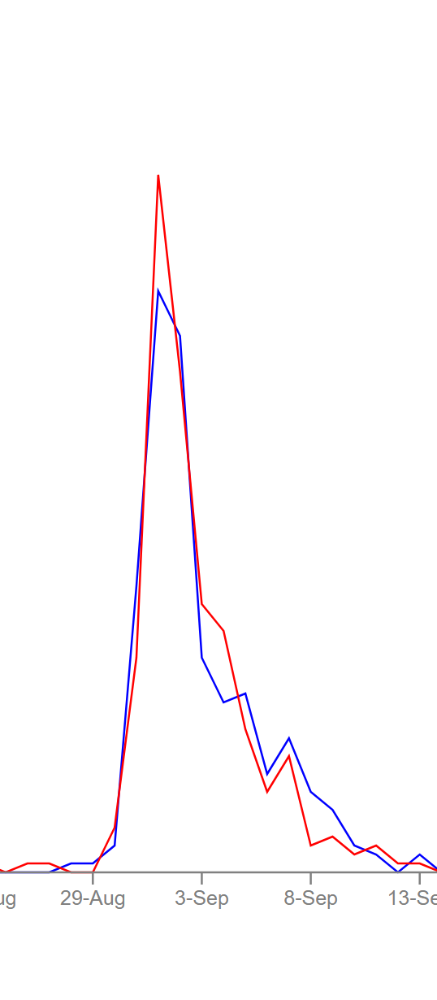

<html lang="en">
<head>
	<meta charset="utf-8">
	<title>DataVis Project01</title>
	<link type="text/css" rel="stylesheet" href="css/stylesheet.css"/>
	
</head>
<body>
	

		
Project 1: John Snow - Cholera Outbreak

		 
		 
         
 <a href="proj1_vis.html">Go to the Visulization</a>

         
		 
		
About:

		

			

				The purpose of this project is to replicate and possibly enhance the work of Dr. John Snow using JavaScript and D3. Dr. John Snow was a Physician interested in understanding the Broad Street Cholera Outbreak in London in 1854; Using the same data collected by Dr Snow I have recreated visualization using modern visualization techniques
                  
				More informationabout Dr. Snow's work during the 1854 Cholera Outbreak is found <a href="https://en.wikipedia.org/wiki/1854_Broad_Street_cholera_outbreak"> on Wikipedia</a>.
                 
                
			

				
		

		
My Design Process

		

			

                When designing my project i was very interested in keeping the interface simple and free of flashy animation and using consitent colors. My first idea was to have a large map with all the infections with a small graph underneath showing the death by day that when hovering over would update the map above.
                 
                 
                Realizing that the screen would be better formatted for deskop view, instead of a vertical view I decided the best format would be a side-by-side design with both visualizations being the same size. This made more sense, considering the data in the line graph would be just as important and interesting as the map.
                 
                 
                In the last itteration of my designs I settled on changing how i would display deaths on the map and the shape of pump houses. I didn't like how having larger circles would crowd eachother and eventually it would be impossible to see anything. So I made a change and used small dots the represented the dead.

            

		

        
        		
My Design Choices

		

            

            I made many conscious design decisions that helped to make the visualization stand out and hopefully be more user friendly. To identify fatailities I stick to only using two different colors. Since the purpose of the visualization is to understand the difference between male and female fatalities I chose red and blue and the two colors to use. This is because they contrast well. I also liked that because i chose to use a lighter opacity to represent one death, having overlap means that high death counts can be identified by purple areas. Darker red or blue areas would mean more men or women died in a specific area. I wanted to represent the pumphouses with green since it is known that the water was infected and that was the source of the issue. Green is often associated with poison or sickness so I used that as a design decision. I chose to keep the visualizations next to eachother so someone using a computer could easily see both on one screen. I used the Web Accessibility Evauation Tool (WAVE) to ensure that I have no accessibility errors. While I have some alerts that are related to HTML structure, there are no color or contrast errors present.
            

	     
	     
	    		
	    
		

	
Video Demo

	

	 
		        <video controls width="720">
  <source src="resource/vis_demo.mp4" type="video/mp4">

Sorry, your browser does not support the &lt;video&gt; tag used in this demo.

</video>

 

        		
Questions and Conclusions

		

			

            The question I was curious about is the difference between male and female. Since the known issue was the infected water in the pumphouses, would gender play a role in fatality. 19th century England being a male dominated society i felt it would have made sense that more women would have been infected (since they would be home gathering water, using it to cook and clean, etc. Not shocking there seems to be more women who are not surviving, especially during the largest spikes of death. Evidence shown below:
 
 
		
            

		

	

	

</body>

</html>
